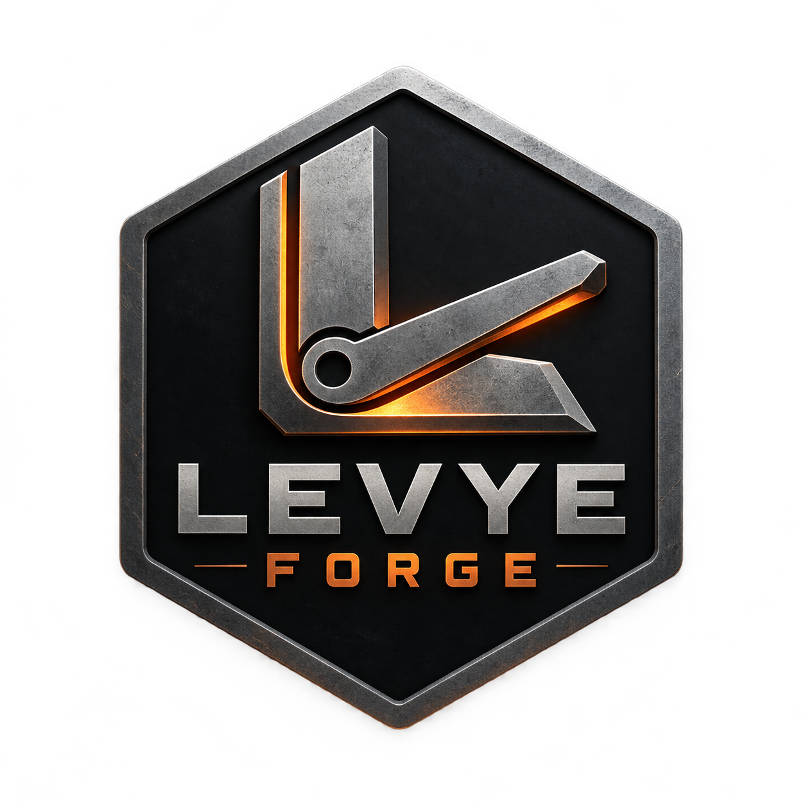

<a id="readme-top"></a>

<!-- PROJECT SHIELDS -->
[![Contributors][contributors-shield]][contributors-url]
[![Forks][forks-shield]][forks-url]
[![Stargazers][stars-shield]][stars-url]
[![Issues][issues-shield]][issues-url]
[![Apache License][license-shield]][license-url]

<!-- PROJECT LOGO -->
<br />
<div align="center">
  <a href="https://github.com/Levye-Studio/LevyeForge">
    
  </a>

  <h3 align="center">Levye Forge</h3>

  <p align="center">
    Levye Studio's 3D game engine, built with OpenGL, GLFW, and Jolt Physics.
    <br />
    <a href="#usage-api"><strong>Explore the docs »</strong></a>
    <br />
    <br />
    <a href="#playable-scene-power-the-beacon">View Demo</a>
    &middot;
    <a href="https://github.com/Levye-Studio/LevyeForge/issues/new?labels=bug">Report Bug</a>
    &middot;
    <a href="https://github.com/Levye-Studio/LevyeForge/issues/new?labels=enhancement">Request Feature</a>
  </p>
</div>

<!-- TABLE OF CONTENTS -->
<details>
  <summary>Table of Contents</summary>
  <ol>
    <li>
      <a href="#about-the-project">About The Project</a>
      <ul>
        <li><a href="#built-with">Built With</a></li>
      </ul>
    </li>
    <li>
      <a href="#getting-started">Getting Started</a>
      <ul>
        <li><a href="#prerequisites">Prerequisites</a></li>
        <li><a href="#installation">Installation</a></li>
      </ul>
    </li>
    <li>
      <a href="#usage-api">Usage API</a>
      <ul>
        <li><a href="#scene-hierarchy">Scene Hierarchy</a></li>
        <li><a href="#physics-in-the-editor">Physics</a></li>
        <li><a href="#properties-and-animation">Properties and Animation</a></li>
        <li><a href="#native-c-scripts">Native C++ Scripts</a></li>
        <li><a href="#lua-scripts">Lua Scripts</a></li>
        <li><a href="#playable-scene-power-the-beacon">Power the Beacon</a></li>
      </ul>
    </li>
    <li><a href="#roadmap">Roadmap</a></li>
    <li><a href="#contributing">Contributing</a></li>
    <li><a href="#license">License</a></li>
    <li><a href="#contact">Contact</a></li>
    <li><a href="#acknowledgments">Acknowledgments</a></li>
  </ol>
</details>

<!-- ABOUT THE PROJECT -->
## About The Project

[![Levye Forge editor screenshot][product-screenshot]](images/screenshot.png)

Levye Forge is Levye Studio's C++ engine and editor for building 3D games. It includes OpenGL rendering, Jolt physics, an entity component system, skeletal animation, native C++ and Lua scripting, and the playable **Power the Beacon** scene.

The editor is **Levye Forge Editor**, built as `ForgeEditor`. The engine library and public header are `LevyeForge` and `LevyeForge.h`.

<p align="right">(<a href="#readme-top">back to top</a>)</p>

### Built With

- [![C++][C++-shield]][C++-url]
- [CMake](https://cmake.org/)
- [OpenGL](https://www.opengl.org/) and [GLFW](https://www.glfw.org/)
- [Jolt Physics](https://github.com/jrouwe/JoltPhysics)
- [Dear ImGui](https://github.com/ocornut/imgui) and [EnTT](https://github.com/skypjack/entt)
- [Assimp](https://github.com/assimp/assimp) and [ozz-animation](https://github.com/guillaumeblanc/ozz-animation)
- [Lua](https://www.lua.org/) and [miniaudio](https://miniaud.io/)

<p align="right">(<a href="#readme-top">back to top</a>)</p>

<!-- GETTING STARTED -->
## Getting Started

### Prerequisites

- Git
- CMake and a C++17 compiler
- OpenGL 4.1 or later

Dependencies are included in `vendor/`.

### Installation

Clone the repository:

```sh
git clone https://github.com/Levye-Studio/LevyeForge.git
cd LevyeForge
```

Run these commands from the repository root on macOS or Linux:

```sh
cmake -S . -B Targets/Debug -DCMAKE_BUILD_TYPE=Debug
cmake --build Targets/Debug --parallel 8
./Run.sh ForgeEditor
```

On Windows:

```bat
Win.bat Debug
Run.bat ForgeEditor
```

The sample application is available through `./Run.sh Sandbox` or `Run.bat Sandbox`. Launch scripts use the Debug build when present, otherwise Release. For a Release build, use `Targets/Release` and `-DCMAKE_BUILD_TYPE=Release`, or `Win.bat Release` on Windows.

<p align="right">(<a href="#readme-top">back to top</a>)</p>

<!-- USAGE API -->
## Usage API

### Repository layout

- `Engine/` — engine library, rendering, scene runtime, physics integration, and platform code.
- `Editor/` — Forge Editor and its tools and resources.
- `Playground/` — standalone Power the Beacon game.
- `Sandbox/` — original sample application.
- `Data/` — shared shaders, fonts, models, and other assets.
- `vendor/` — third-party dependencies.

Applications include `<LevyeForge.h>` and link the `LevyeForge` CMake target. Engine types use the `LevyeForge` C++ namespace, for example `LevyeForge::Application`. Preprocessor macros use the `LF_` prefix, for example `LF_PLATFORM_WINDOWS`, `LF_CORE_ASSERT`, and `LF_PROFILE_FUNCTION`.

<p align="right">(<a href="#readme-top">back to top</a>)</p>

### Scene hierarchy

Drag an entity onto another entity in **Scene Hierarchy** to make it a child. Drop it on **Scene Root** to unparent it. Both actions preserve its world position, rotation, and scale. Expand the arrow beside a parent to see its children.

Right-click an entity for **Create Child**, **Move to Scene Root**, **Duplicate**, or **Delete Entity and Children**. Duplicating includes the entire subtree with new entity IDs; deleting a parent also deletes its descendants and physics bodies. Parent links persist when saving/loading scenes and entering Play mode.

Child Transform fields (and Lua transform accessors) are relative to the parent. Moving a parent moves its descendants; viewport gizmos operate on the child's world pose. Reparenting rejects cycles and transforms that cannot be represented by position/rotation/scale, such as shear from rotated, nonuniformly scaled parents. Use uniform parent scale for physics hierarchies.

<p align="right">(<a href="#readme-top">back to top</a>)</p>

### Physics in the editor

Select an entity in Scene Hierarchy and use **Add Component → Rigid Body** plus **Box Collider** or **Sphere Collider**. Set moving objects to **Dynamic** and floors to **Static**, then press Play. The default playground includes a physical player body, floor, walls, and platforms.

Collider sizes are local to the entity and include its transform scale. Rotation fields in the inspector use degrees; transforms store radians. Mass, gravity, damping, initial velocity, friction, restitution, and trigger settings are editable before Play and saved with the scene. Kinematic bodies follow transform changes from scripts. Physics steps at 60 Hz.

Stop returns to the editor scene without keeping simulated positions. Existing `.UE` scenes with the older box/sphere component names are supported. The current integration supports box and sphere colliders; arbitrary mesh colliders and a general-purpose capsule character controller are not implemented. The playground uses a rotation-locked box body with ground probes.

<p align="right">(<a href="#readme-top">back to top</a>)</p>

### Properties and animation

The **Properties → Add Component** menu includes models, animators, sprites, lights, skyboxes, cameras, cubes, circles, rectangles, lines, UI images, buttons, text, native scripts, Lua scripts, and physics components. Asset fields accept typed paths or files dragged from the content browser. Component settings are included in scene save/load and duplication.

To animate a character:

1. Add **Model** and load a rigged model, such as `Resources/Animations/Idle.fbx`.
2. Add **Animator** and load a compatible animation file, such as `Resources/Animations/Running.fbx`.
3. Use **Play/Pause**, **Restart**, **Loop**, **Speed**, and the **Time** slider to preview or scrub the clip. **Clip index** selects a clip in files with multiple animations.

The default demo character plays its idle animation. Edit and Play modes use separate playback state. Animation tracks must match the model's joint names; the current renderer supports 100 deforming bones with four normalized influences per vertex; helper joints do not consume palette entries. Native script bindings and button callbacks are supplied by C++ code, not serialized executable code.

<p align="right">(<a href="#readme-top">back to top</a>)</p>

### Component visualization

Use **Camera → Show Camera Frustum** and **Box/Sphere Collider → Show Collider Wireframe** for per-entity previews. These settings save with the scene. Optional components have **... → Remove Component**; Transform is required.

<p align="right">(<a href="#readme-top">back to top</a>)</p>

### Native C++ scripts

Register compiled classes before loading scenes, then choose the class in **Native Script → Class**. The editor registers **Player Controller**, a WASD example that supports transform movement, kinematic movement, or a dynamic rigid body. It does not require a camera or a model. Native C++ source changes require rebuilding the application.

```cpp
class Spin : public LevyeForge::ScriptableEntity {
    void OnUpdate(LevyeForge::Timestep dt) override {
        GetComponent<LevyeForge::TransformComponent>().Rotation.y += float(dt);
    }
};
LevyeForge::NativeScriptRegistry::Register<Spin>("Spin");
```

Scripts receive `OnCreate`, `OnUpdate`, and `OnDestroy` during Play. `OnImGuiRender` displays custom controls in the selected script's Properties section. The registered class name and enabled state save with the scene. **Restart Script** creates a fresh runtime instance on the next update. Play copies and duplicated entities never share script instances. C++ exceptions are reported in Properties.

<p align="right">(<a href="#readme-top">back to top</a>)</p>

### Lua scripts

Lua 5.4.9 is bundled from [the official Lua source archive](https://www.lua.org/ftp/); no system Lua installation is needed. The [Lua 5.4 manual](https://www.lua.org/manual/5.4/) documents the language.

Add **Lua Script**, load a `.lua` file (or drag one from the content browser), and press Play. Try `Resources/Scripts/Spin.lua` or `Resources/Scripts/Move.lua`. Paths are relative to the app's working directory, normally `Targets/Debug/bin` when launched with `Run.sh`. Project scripts in `Editor/Resources/Scripts` are copied there when the editor builds.

```lua
function on_create()
    log("Script started")
end

function on_update(dt)
    local x, y, z = entity:get_rotation()
    entity:set_rotation(x, y + math.rad(45) * dt, z)
end

function on_destroy()
    log("Script stopped")
end
```

Each entity has a separate Lua state. Callbacks are optional and run only in Play mode. **Reload Script** loads the edited file into a fresh state on the next update. Errors appear in the Lua component and console; a failed script stops until reloaded, re-enabled, or Play is restarted.

| API | Behavior |
| --- | --- |
| `entity:get_position()`, `get_rotation()`, `get_scale()` | Return three coordinates; rotations use radians. |
| `entity:set_position(x,y,z)`, `set_rotation(x,y,z)` | Update the transform and an existing physics body. |
| `entity:set_scale(x,y,z)` | Update scale and rebuild the physics shape if present. |
| `entity:set_velocity(x,y,z)` | Set a Dynamic rigid body's velocity; use position changes for Kinematic bodies. |
| `entity:play_animation(path, clip_index)` | Start a clip on an existing Animator; returns success and an error string. Clip index defaults to zero. |
| `entity:destroy()` | Queue this entity for destruction after the frame. |
| `input.is_key_down(Key.W)` | Read input. A–Z, Space, and LeftShift constants are available. |
| `log("message")` | Write to the engine console. |

A callback instruction limit catches runaway Lua loops. Scripts use the standard Lua libraries and are intended for trusted project code.

<p align="right">(<a href="#readme-top">back to top</a>)</p>

### Playable scene: Power the Beacon

The editor opens this playground by default. Press **Play**, then click the viewport to give it keyboard focus. **File → New Playground** creates a fresh copy. The editable scene is also available as `Resources/Scenes/PowerTheBeacon.UE`.

Run it without the editor:

```sh
cmake --build Targets/Debug --target Playground --parallel 8
./Run.sh Playground
```

Collect three green energy cells from the platforms, then activate the beacon behind the tallest platform. Use the middle step to reach the tallest platform.

| Control | Action |
| --- | --- |
| WASD | Move relative to the camera |
| Space | Jump |
| Left Shift | Sprint |
| E | Collect a nearby cell or activate the beacon |
| Hold right mouse and drag | Orbit the follow camera |
| R | Restart the course |
| M | Mute/unmute sound |
| Escape | Close the standalone game |

The demo includes ground detection, jump buffering, a short coyote-time window, camera obstruction checks, idle/run/jump pose crossfades, in-place character animation, a progress HUD, and synthesized jump/pickup/completion sounds. Native `OnLateUpdate` callbacks keep the visible character and camera aligned after physics.

The controller looks up the named Player Body, Man, Playground Camera, Energy Cell 1–3, and Beacon entities. Keep those names when editing the demo. Interaction uses proximity and an E press; it does not add a general physics contact-event API. The box controller is intended for this course, not yet for arbitrary terrain or automatic stair climbing.

Sound uses bundled [miniaudio 0.11.21](https://github.com/mackron/miniaudio/tree/0.11.21) and requires no external audio assets. If no output device is available, the game continues silently and the HUD indicates that.

The playground hierarchy groups the environment, objectives, lighting, and player under **Power the Beacon**. **Man** is a child of **Player Body**. Walls, platforms, path markers, energy cells, and the beacon assembly each have their own groups.

<p align="right">(<a href="#readme-top">back to top</a>)</p>

<!-- ROADMAP -->
## Roadmap

- [x] Editor with nested scene hierarchy and drag-and-drop parenting
- [x] Box and sphere physics, skeletal animation, and native/Lua scripting
- [x] Playable Power the Beacon scene
- [ ] Mesh colliders and a capsule character controller
- [ ] General physics contact events
- [ ] Platform installers and game distribution packaging

See the [open issues][issues-url] for proposed features and reported bugs.

<p align="right">(<a href="#readme-top">back to top</a>)</p>

<!-- CONTRIBUTING -->
## Contributing

Open an issue to discuss a bug or feature, or submit a pull request with a focused change. Include steps to reproduce bugs and describe how you verified a fix.

1. Fork the project.
2. Create a branch for your change.
3. Build the editor and verify the affected behavior.
4. Open a pull request against `main`.

<p align="right">(<a href="#readme-top">back to top</a>)</p>

<!-- LICENSE -->
## License

Distributed under the Apache License 2.0. See [LICENSE](LICENSE) for details. Third-party dependencies and assets retain their respective licenses.

<p align="right">(<a href="#readme-top">back to top</a>)</p>

<!-- CONTACT -->
## Contact

[Levye Studio](https://github.com/Levye-Studio)

Project: [LevyeForge](https://github.com/Levye-Studio/LevyeForge)

For bugs and feature requests, use the [issue tracker][issues-url].

<p align="right">(<a href="#readme-top">back to top</a>)</p>

<!-- ACKNOWLEDGMENTS -->
## Acknowledgments

- [Urban Engine](https://github.com/Genesis-Grid-Lab/urban-engine), originally developed by Nesmy Point Du Jour and contributors
- The maintainers of the dependencies included in `vendor/`
- [Best-README-Template](https://github.com/othneildrew/Best-README-Template) for this README layout
- [Shields.io](https://shields.io/) for the badges

<p align="right">(<a href="#readme-top">back to top</a>)</p>

<!-- MARKDOWN LINKS & IMAGES -->
[contributors-shield]: https://img.shields.io/github/contributors/Levye-Studio/LevyeForge.svg?style=for-the-badge
[contributors-url]: https://github.com/Levye-Studio/LevyeForge/graphs/contributors
[forks-shield]: https://img.shields.io/github/forks/Levye-Studio/LevyeForge.svg?style=for-the-badge
[forks-url]: https://github.com/Levye-Studio/LevyeForge/forks
[stars-shield]: https://img.shields.io/github/stars/Levye-Studio/LevyeForge.svg?style=for-the-badge
[stars-url]: https://github.com/Levye-Studio/LevyeForge/stargazers
[issues-shield]: https://img.shields.io/github/issues/Levye-Studio/LevyeForge.svg?style=for-the-badge
[issues-url]: https://github.com/Levye-Studio/LevyeForge/issues
[license-shield]: https://img.shields.io/github/license/Levye-Studio/LevyeForge.svg?style=for-the-badge
[license-url]: https://github.com/Levye-Studio/LevyeForge/blob/main/LICENSE
[product-screenshot]: images/screenshot.png
[C++-shield]: https://img.shields.io/badge/C%2B%2B-00599C?style=for-the-badge&logo=cplusplus&logoColor=white
[C++-url]: https://isocpp.org/
